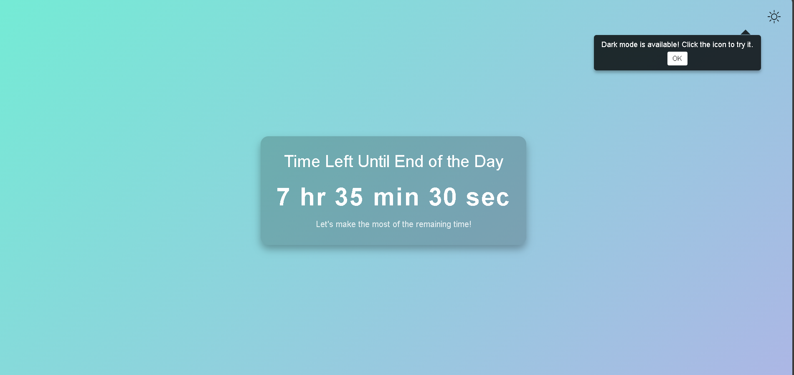

# Day Countdown Timer

A sleek and responsive web application that displays the remaining time until the end of the current day. Features an elegant design with dark/light mode toggle and theme-aware notifications.



## Features

- **Real-time Countdown**: Displays hours, minutes, and seconds remaining until midnight
- **Theme Switching**: 
  - Toggle between light and dark modes
  - Persistent theme preference using localStorage
  - Smooth transition animations
- **Responsive Design**:
  - Adapts to different screen sizes
  - Mobile-friendly interface
- **Smart Notifications**:
  - Context-aware theme suggestions
  - Automatic dismissal
  - Custom positioning aligned with theme toggle
- **Accessibility**: Clear contrast ratios and readable fonts

## Installation

1. Clone the repository:
```bash
git clone https://github.com/nishant-awasthi026/Time-Left-Until-End-of-the-Day.git
```

2. Navigate to the project directory:
```bash
cd day-countdown-timer
```

3. Open `index.html` in your preferred web browser.

## Usage

The timer starts automatically upon loading the page. The interface includes:

- A prominent countdown display
- A theme toggle button in the top-right corner
- Smart notifications suggesting theme changes

### Theme Toggle

Click the sun/moon icon in the top-right corner to switch between light and dark modes. Your preference will be saved automatically.

## Customization

### Colors

Modify the gradient colors in the CSS:

```css
body {
    background: linear-gradient(135deg, #74ebd5, #acb6e5); /* Light mode */
}

.dark-mode {
    background: #121212; /* Dark mode */
}
```

### Timer Format

Adjust the timer display format in the JavaScript:

```javascript
document.getElementById('timer').textContent = 
    `${hours} hr ${minutes} min ${seconds} sec`;
```

### Notification Timing

Change the popup timing in the JavaScript:

```javascript
// Initial popup delay (currently 3 seconds)
setTimeout(() => {
    popup.style.display = 'block';
}, 3000);

// Popup display duration after theme toggle
setTimeout(() => {
    popup.style.display = 'none';
}, 3000);
```

## Browser Support

- Chrome (latest)
- Firefox (latest)
- Safari (latest)
- Edge (latest)
- Opera (latest)

## Technical Details

### Technologies Used

- HTML5
- CSS3
- Vanilla JavaScript

### Key Components

1. **Timer Logic**:
   - Uses `Date` object for time calculations
   - Updates every second using `setInterval`
   - Handles day rollover automatically

2. **Theme System**:
   - Uses CSS classes for theme switching
   - Implements localStorage for persistence
   - Smooth transitions using CSS

3. **Notification System**:
   - Context-aware messaging
   - Automatic positioning
   - CSS-based animations

## Performance Considerations

- Minimal DOM operations
- Efficient CSS transitions
- No external dependencies
- Lightweight implementation

## Contributing

1. Fork the repository
2. Create your feature branch (`git checkout -b feature/AmazingFeature`)
3. Commit your changes (`git commit -m 'Add some AmazingFeature'`)
4. Push to the branch (`git push origin feature/AmazingFeature`)
5. Open a Pull Request

## License

This project is licensed under the MIT License - see the [LICENSE.md](LICENSE.md) file for details.

## Acknowledgments

- Icons provided by [Icons8](https://icons8.com/)
- Gradient inspiration from [uiGradients](https://uigradients.com/)

## Contact

Your Name - [@yourtwitter](https://twitter.com/yourtwitter)
Project Link: [https://github.com/yourusername/day-countdown-timer](https://github.com/yourusername/day-countdown-timer)
